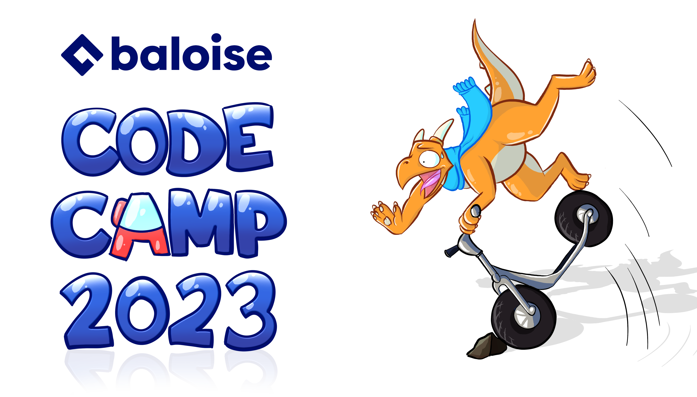

# Code Camp - Real-Time Collaboration Project 

This Repository contains work from the 2023 October Code camp. 
We aim to create an application which allows for realtime collaborative work for multiple users on a simple web-interface.

More Details TBD.

https://www.adesso.de/de/news/blog/websockets-leichtgemacht-mit-stomp-js-und-spring-boot.jsp

The latest version of the app can be tested here:
https://realtimecollab-test.apps.baloise.dev/

## Thank you! ##
Thank you guys for the awesome time together and all the nice memories! Looking forward to seeing you guys again next time!

